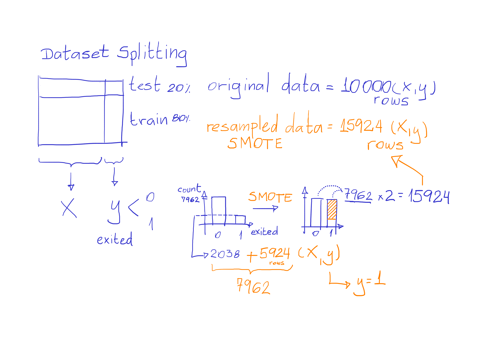

# Machine Learning - Bank Customer Churn Prediction

Dataset from Kaggle:
https://www.kaggle.com/datasets/radheshyamkollipara/bank-customer-churn?resource=download

## Description

The file **ml-bank-churn-prediction.ipynb** contains all the code for this project.

We are going to explore 6 different models and choose the best based on accuracy and precision.
- Logistic Regression
- SVC (Support Vector Classification)
- KNN (k-Nearest Neighbors)
- DT (Decision Tree)
- RF (Random Forest)
- GBC (Gradient Boosting Classifier)

The winner model is the RF (Random Forest) that returns the value 1 when it's very likely for the client to churn.

Dataset file Customer-Churn-Records.csv details:

1. RowNumber: corresponds to the record (row) number and has no effect on the output.
2. CustomerId: contains random values and has no effect on customer leaving the bank.
3. Surname: the surname of a customer has no impact on their decision to leave the bank.
4. CreditScore: can have an effect on customer churn, since a customer with a higher credit score is less likely to leave the bank.
5. Geography: a customer’s location can affect their decision to leave the bank.
6. Gender: it’s interesting to explore whether gender plays a role in a customer leaving the bank.
7. Age: this is certainly relevant, since older customers are less likely to leave their bank than younger ones.
8. Tenure: refers to the number of years that the customer has been a client of the bank. Normally, older clients are more loyal and less likely to leave a bank.
9. Balance: also a very good indicator of customer churn, as people with a higher balance in their accounts are less likely to leave the bank compared to those with lower balances.
10. NumOfProducts: refers to the number of products that a customer has purchased through the bank.
11. HasCrCard: denotes whether or not a customer has a credit card. This column is also relevant, since people with a credit card are less likely to leave the bank.
12. IsActiveMember: active customers are less likely to leave the bank.
13. EstimatedSalary: as with balance, people with lower salaries are more likely to leave the bank compared to those with higher salaries.
14. Exited: whether or not the customer left the bank.
15. Complain: customer has a complaint or not.
16. Satisfaction Score: Score provided by the customer for their complaint resolution.
17. Card Type: type of card held by the customer.
18. Points Earned: the points earned by the customer for using a credit card.

## Getting Started

### Dependencies

* Python              3.11.3
* Pandas              2.0.2
* scikit-learn        1.3.0
* seaborn             0.12.2
* imblearn            0.0

## Dataset splitting and SMOTE drawings

## License

This project is licensed under the MIT License - see the LICENSE file for details
